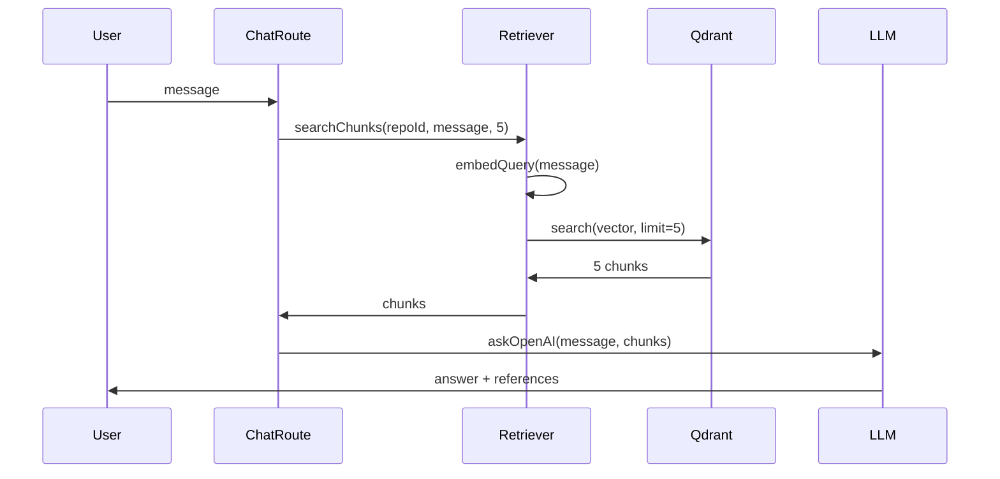
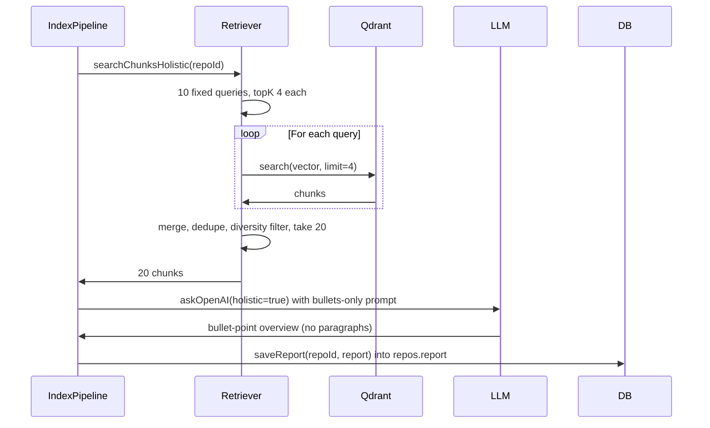
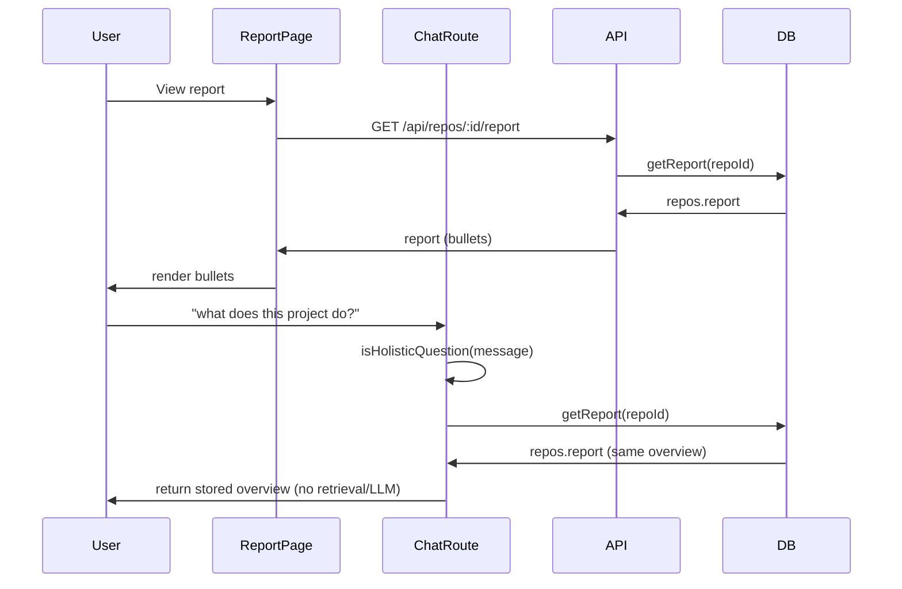

# Multi-query holistic retrieval plan

## Goal

**Single place for project details:** Users get all overview content (purpose, features, APIs, architecture) from **one source** — the content stored in `repos.report`.

- **At index time:** Run **10 fixed semantic queries** against Qdrant, merge/dedupe/diversity filter to ~20 chunks, send to LLM with holistic prompt. LLM returns **bullet-point overview** (no paragraphs). Store result in **Postgres `repos.report`** ([apps/server/src/db.ts](apps/server/src/db.ts), [apps/server/migrations/002_report.sql](apps/server/migrations/002_report.sql)).
- **Report page:** Reads from `repos.report` and displays the stored overview (bullets).
- **Chat (holistic questions):** For "what does this project do?", "overview", "main features", "architecture" — **do not** run retrieval/LLM again; **return the stored overview from `repos.report`** so the user sees the same content as on the Report page.
- **Remove or shrink** the current report extractor (package.json for tech stack/features, regex for routes/models, `buildHighLevelFlow`) — replace with this index-time holistic pipeline; keep minimal deterministic bits only if needed.

Narrow questions (e.g. "where is the login function?") keep **single-query retrieval** (current behavior).

---

## Current flow



Single query, top 5, one system prompt. No notion of "holistic" vs narrow.

---

## Target flow: index time (generate overview once)



## Target flow: Report page and chat (read from one place)



---

## 0. Storage and output format

**Where responses are stored:** Postgres only — `**repos.report` (existing JSONB column). No separate store; the index-time LLM output is written via `saveReport(repoId, report)` after indexing.

**Output format: bullets only, no paragraphs.** The overview must show only core/main points in bullet form.

- **Prompt:** Instruct the LLM explicitly: "Respond only with bullet points. No paragraphs. List only the main/core points: purpose, main features, key APIs, architecture. Keep each bullet one line."
- **Stored schema:** Store as arrays of strings so the UI can render bullets. For example in [packages/types/src/report.ts](packages/types/src/report.ts): `overview: string[]` or sectioned `purpose: string[]`, `features: string[]`, `keyApis: string[]`, `architecture: string[]` (each array = list of bullet strings).
- **UI:** Report page and chat both render these arrays as `<ul>/<li>` (or bullet component) so the user always sees bullets, not prose.

---

## 1. Holistic intent detection

**Where:** [apps/server/src/routes/chat.ts](apps/server/src/routes/chat.ts) (or a small helper in retriever/llm).

**Logic:** Treat the user message as holistic if it matches (case-insensitive) any of:

- "what does this project do"
- "what does it do"
- "overview"
- "main features"
- "architecture"
- "explain this project"
- "describe this codebase"
- "what is this repo"

Use a short list of phrases or a regex. Optionally allow up to 10 such phrases. If matched → call multi-query retrieval and holistic prompt; else → current single-query retrieval.

**API:** e.g. `isHolisticQuestion(message: string): boolean`.

---

## 2. Multi-query retrieval in retriever

**Where:** [packages/retriever/src/search.ts](packages/retriever/src/search.ts).

**New function:** `searchChunksHolistic(qdrant, openai, repoId, options?)`.

**Fixed queries (10) — architecture, flows, domain logic, integrations:**

Queries target different layers so retrieved chunks represent the whole system (suited for 10k+ LOC repos).

1. **Project purpose & domain logic:** "What is the main purpose of this project and what domain problem does it solve" — README, main services, domain logic.
2. **Core entry points:** "Where does the application start and what are the main entry points of the system" — main files, server startup, framework bootstrap.
3. **Major features:** "What major features or capabilities are implemented in this project" — feature services, major modules.
4. **API surface:** "What APIs, controllers, or external interfaces are implemented in this project" — routes, controllers, endpoints, handlers.
5. **Business logic layer:** "What core services, business logic modules, or processing components exist in the project" — service layer, domain logic, processing pipelines.
6. **Data model & persistence:** "How does the project structure and manage its data models and persistence layer" — models, schemas, repositories, ORM logic.
7. **External integrations:** "What external services, APIs, or third party integrations are used in this project" — payments, cloud storage, messaging, analytics.
8. **Background & async:** "What background jobs, queues, or asynchronous processing workflows exist in the project" — workers, schedulers, queue processors.
9. **Security & access control:** "What authentication, authorization, or security mechanisms are implemented in this project" — auth middleware, JWT, permissions.
10. **System architecture:** "How are the main components of the system structured and how do they interact with each other" — service interactions, module dependencies, structure.

**Config (tunable):**

- `topKPerQuery = 4` → 10 × 4 = 40 chunks before dedupe
- `maxChunksReturned = 20` (or 20–25) so the LLM gets representative code from every layer
- Keep queries in a constant array (e.g. `HOLISTIC_QUERIES`) for easy tuning
- Chunk size: keep current indexer granularity; optional later increase to ~600 tokens per chunk for less fragmentation

**Steps:**

1. For each of the 10 queries: `embedQuery(openai, query)` then `qdrant.search(COLLECTION, { vector, limit: 4, filter: { must: [{ key: "repo_id", match: { value: repoId } }] }, with_payload: true })`.
2. Merge all results into one list; **dedupe by `chunk_id`** (keep first occurrence).
3. **Diversity filter:** Group by `filePath` → cap at `maxChunksPerFile = 2`; group by folder (`dirname(filePath)`) → cap at `maxChunksPerFolder = 4`; optionally prefer chunks that have symbol names (`preferChunksWithSymbols = true`) to favor meaningful symbols over anonymous snippets. Apply file cap first, then folder cap.
4. Take first `maxChunksReturned` (20) and return `SearchResult[]` (same shape as current `searchChunks`).

**Why this query set:** Ensures retrieval covers project purpose (1), startup (2), features (3), APIs (4), business logic (5), data layer (6), integrations (7), async workflows (8), security (9), and architecture (10). Even for 10k–50k LOC repos, the LLM receives representative code from every layer, not random implementation details.

**Export:** Add `searchChunksHolistic` to [packages/retriever/src/index.ts](packages/retriever/src/index.ts).

---

## 3. Chat route: holistic = return stored report

**Where:** [apps/server/src/routes/chat.ts](apps/server/src/routes/chat.ts).

**Logic:**

- If `isHolisticQuestion(message)`:
  - **Do not** run retrieval or LLM. Load the stored report: `getReport(repoId)` from DB.
  - Return the overview from `repos.report` to the user (same content as Report page). Optionally wrap in a short line e.g. "Here's the project overview:" then the bullets.
- Else:
  - Keep current: `searchChunks(qdrant, openai, repoId, message, 5)` and existing prompt + LLM.

This keeps a single source of truth: one overview generated at index time, read everywhere.

---

## 4. Context format sent to LLM

**Where:** [packages/llm/src/prompt.ts](packages/llm/src/prompt.ts).

**Current:** `FILE: path (symbolName)\nCODE:\ncontent`

**New (for holistic):** Include a TYPE line so the model can reason about architecture:

```
FILE: src/api/authController.ts
TYPE: controller

CODE:
<content>

---

FILE: src/services/authService.ts
TYPE: service

CODE:
<content>
```

**Implementation:**

- Extend `ContextChunk` with optional `symbolType?: string` (and optionally `displayType?: string`).
- In [packages/retriever/src/search.ts](packages/retriever/src/search.ts), `SearchResult` already has `symbolType`; pass it through to the LLM context (chat route maps SearchResult → ContextChunk including symbolType).
- Add a **display type** derived from path + symbolType when building the block: e.g. path contains "controller" or "Controller" → "controller"; "service" / "Service" → "service"; "model" / "Model" / "repository" / "Repository" → "model" or "repository"; else use `symbolType` (function / class / method). This keeps the context block human-readable.
- `buildContextBlock(chunks, options?: { includeType?: boolean })`: when `includeType` is true (holistic path), use the FILE + TYPE + CODE format; otherwise keep current format for backward compatibility.

---

## 5. Holistic system prompt (bullets only)

**Where:** [packages/llm/src/prompt.ts](packages/llm/src/prompt.ts).

**New:** e.g. `buildHolisticSystemPrompt(): string` with content along the lines of:

- You are analyzing a software repository. Based only on the provided code snippets, produce a holistic overview.
- **Output format: bullet points only. No paragraphs.** List only the core/main points. Keep each bullet one line. Include: (1) what the project does, (2) main features, (3) key APIs or interfaces, (4) core architecture / how components interact, (5) key technologies. Do not invent features not visible in the code.
- Optionally ask for structured sections (e.g. Purpose, Features, APIs, Architecture) each as a list of bullets so the response can be stored in sectioned arrays (`purpose: string[]`, etc.) in `repos.report`.

**Where used:** At **index time** in the server pipeline after `searchChunksHolistic`: call `askOpenAI(..., { holistic: true })` which uses `buildHolisticSystemPrompt()` and `buildContextBlock(..., { includeType: true })`. Parse the LLM response into the bullet arrays and save via `saveReport`. Not used in the chat route for holistic questions (chat returns stored report).

---

## 6. Chunk size (optional / later)

Current chunks are **one per function/class/method** ([packages/indexer/src/parse.ts](packages/indexer/src/parse.ts)); size is variable. The spec suggests 500–700 tokens per chunk for less fragmented context.

- **This plan:** Keep current chunk granularity. Multi-query + 20 chunks already increases total context; diversity filter improves coverage.
- **Later:** If needed, consider larger semantic units (e.g. merge small functions in the same file) or different segmentation in the indexer; that would be a separate change.

---

## 7. When holistic retrieval runs (index pipeline)

**Where:** Same place that currently runs report extraction after indexing — e.g. in [apps/server](apps/server) after `indexRepo` completes (and after embeddings are in Qdrant). Replace or run alongside the current extractor.

**Steps:** (1) Call `searchChunksHolistic(qdrant, openai, repoId)` to get 20 chunks. (2) Call `askOpenAI` with those chunks and `holistic: true` (no user message needed, or use a fixed "Summarize this codebase" message). (3) Parse LLM response into bullet arrays (e.g. by section or one flat `overview: string[]`). (4) Build report object and call `saveReport(repoId, report)`. (5) Optionally remove or shrink [apps/server/src/services/report-extractor.ts](apps/server/src/services/report-extractor.ts) (package.json, regex routes/models, buildHighLevelFlow) so the report is produced only by this pipeline.

---

## 8. Files to add or change

| Area                   | Change                                                                                                                                                                                                                                                                               |
| ---------------------- | ------------------------------------------------------------------------------------------------------------------------------------------------------------------------------------------------------------------------------------------------------------------------------------ |
| **packages/types**     | Extend report types: add bullet-array fields for overview (e.g. `overview: string[]` or `purpose`, `features`, `keyApis`, `architecture` as `string[]`) in [packages/types/src/report.ts](packages/types/src/report.ts).                                                             |
| **packages/retriever** | Add `searchChunksHolistic` (10 queries, topK 4 each, merge, dedupe, diversity filter with preferChunksWithSymbols, return 20). Export from index.                                                                                                                                    |
| **packages/llm**       | Extend `ContextChunk` with `symbolType?`; add `buildHolisticSystemPrompt()` (bullets only); extend `buildContextBlock` with TYPE and optional format; extend `askOpenAI` with `holistic` option. Used at index time.                                                                 |
| **apps/server**        | After index: call `searchChunksHolistic` then LLM with holistic prompt; parse response to bullet arrays; `saveReport`. Chat route: `isHolisticQuestion(message)` → return stored `getReport(repoId)` overview, else single-query retrieval + LLM. Remove or shrink report-extractor. |
| **apps/web**           | Report page: render overview from `repos.report` as bullets (`<ul>/<li>`). Chat UI: when response is holistic, display the returned bullets the same way.                                                                                                                            |

---

## 8. Diversity filter (concrete)

- After dedupe by `chunkId`, order by: original order of first appearance (or by score if you keep scores from Qdrant). Optionally sort so chunks with a non-empty `symbolName` come first (`preferChunksWithSymbols = true`) to favor meaningful symbols.
- **Per-file cap:** For each `filePath`, keep at most 2 chunks (e.g. keep first 2).
- **Per-folder cap:** `folder = filePath.split(/[/\\]/).slice(0, -1).join('/')`; per folder, keep at most 4 chunks.
- **Final:** Slice to `maxChunksReturned` (20).

This gives architecture coverage and avoids retrieving many chunks from a single service file.

---

## 10. Testing

- After indexing a repo, report is generated and stored in `repos.report` with bullet-point overview (no paragraphs).
- Report page shows the same bullets from `repos.report`.
- Ask a holistic question ("what does this project do?") in chat → response is the stored overview (bullets), no second retrieval/LLM.
- Ask a narrow question ("where is the login function?") → single-query retrieval + LLM unchanged.
- Verify no duplicate sources: one place (`repos.report`) for overview content.

---

## 11. Summary

**Single source of truth:** Overview is generated **once at index time** via 10 fixed semantic queries → 20 chunks → LLM with **bullets-only** prompt → stored in `**repos.report`** (Postgres). Report page and chat (holistic questions) both read from this; chat does not run retrieval/LLM for holistic Qs. Output is **bullets only, core/main points — no paragraphs. The current report extractor (package.json, regex routes/models) can be removed or shrunk. Narrow questions keep single-query retrieval.
