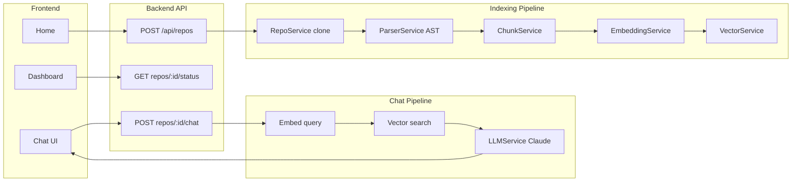

# Overview and architecture

## Current state

Workspace is **empty**. Full project will be created from scratch.

## High-level flow

## How pieces connect

- **User** submits a GitHub URL on the **Home** page → **Backend** creates a repo record and runs the **indexing pipeline** (clone → parse → chunk → embed → vector).
- **Dashboard** polls repo **status** and shows progress; when ready, **Chat** sends questions to **Chat API** → **retriever** (embed + vector search) → **LLM** → answer with file references.

See [10-implementation-order.md](10-implementation-order.md) for the suggested build order.
